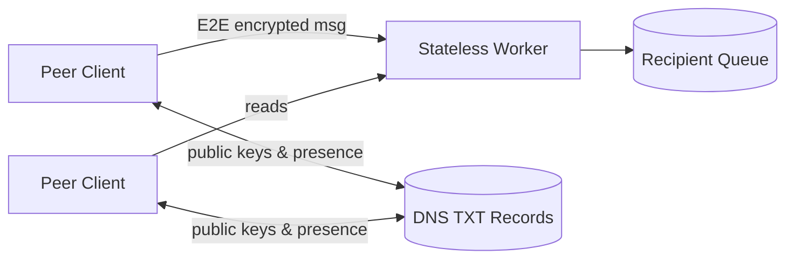

# OVRLab — Web 5.0 Client-Powered Cloud Network

OVRLab is a research and engineering lab exploring **Web 5.0**: a new paradigm where **clients are the cloud**. Instead of relying on centralized application servers, we build systems where user devices coordinate directly—using cryptography for trust and minimal infrastructure only for availability.

## What we’re building

We’re prototyping **Peer-Queue-Peer (PqP)**: a decentralized communication model that combines peer-to-peer principles with cloud-mediated messaging to remove traditional servers while retaining reliable connectivity.

High-level ideas:

- **Peers run the logic**: each client owns its identity and executes the protocol locally.
- **Cloud is an untrusted relay**: encrypted messages travel through ephemeral cloud queues and a stateless worker, which cannot read message contents.
- **DNS as a directory**: peers publish presence and public keys via DNS TXT records to discover each other globally without custom bootstrap servers.
- **End-to-end security**: signatures + encryption ensure integrity and confidentiality regardless of the relay.

## Architecture (high level)

## Components

- **Cloud Worker** — Minimal API surface for queue operations and DNS updates.
- **PqP Network Library** — Shared client library implementing discovery, encryption, message envelopes, and orchestration.
- **Browser Extension Client** — Browser-based peer node (Chrome extension).
- **Electron Desktop Client** — Cross-platform peer node (desktop app).

## Status

These repositories are currently in an **early/prototype phase** and may change quickly as the research evolves.
